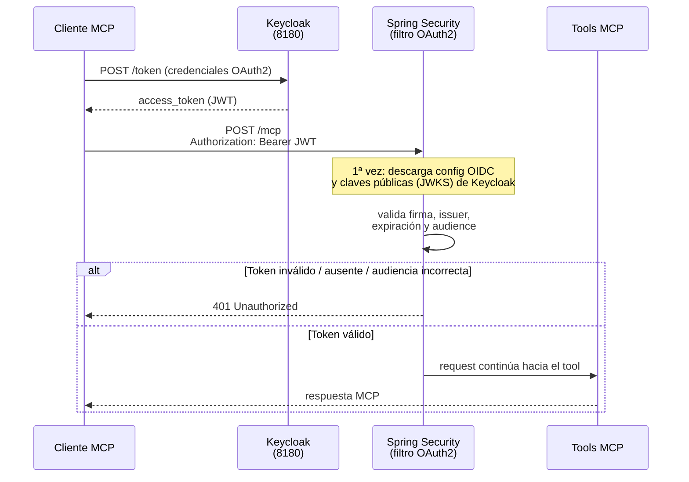
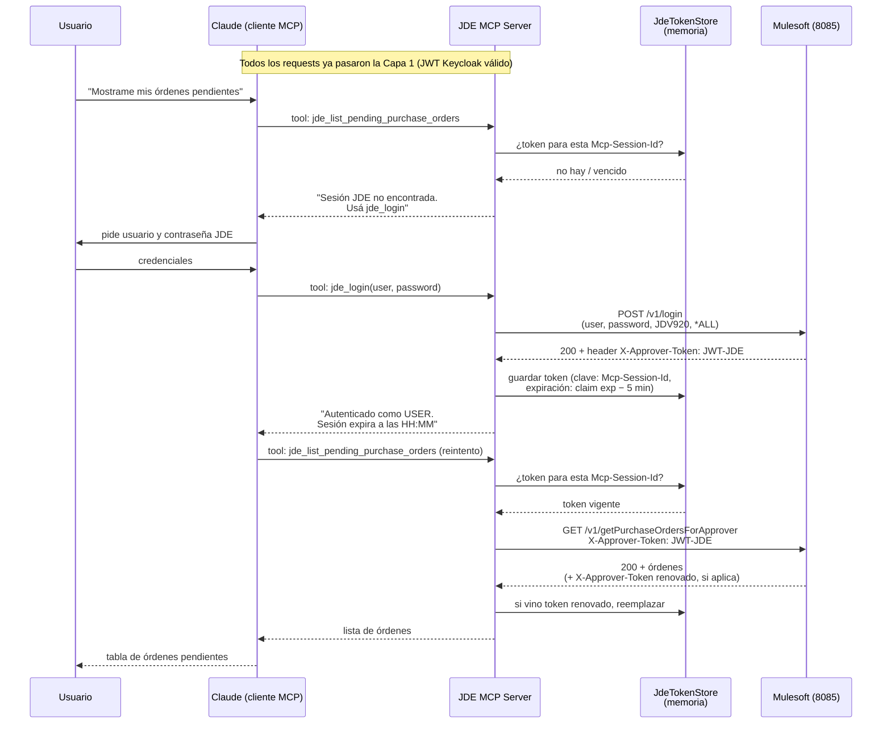

# Autenticación — paso a paso

Este documento explica cómo funciona la autenticación del JDE MCP Server después de la migración a Keycloak. Está pensado para leerse de arriba hacia abajo: primero la idea general, después cada capa en detalle.

---

## La idea general: dos capas independientes

El servidor maneja **dos autenticaciones distintas que no se mezclan**. Entender esta separación es la clave de todo el documento:

| | Capa 1 — Keycloak (OAuth2) | Capa 2 — Sesión JDE (Mulesoft) |
|---|---|---|
| **Pregunta que responde** | ¿Quién sos y podés hablar con este MCP Server? | ¿Qué usuario JDE sos y qué podés hacer en JDE? |
| **Token** | JWT de Keycloak | JWT de Mulesoft/JDE |
| **Viaja en el header** | `Authorization: Bearer <jwt>` | `X-Approver-Token: <jwt>` |
| **Quién lo valida** | Spring Security (este servidor) | Mulesoft / JDE |
| **Cómo se obtiene** | Flujo OAuth2 contra Keycloak | Token de Atina (claim del JWT de Keycloak u OpenBao), Identity Bridge (automático), o tool `jde_login` (fallback manual) |
| **Dónde se guarda** | No se guarda (viene en cada request) | `JdeTokenStore` (en memoria, por sesión MCP); el token de Atina no se guarda (viene en el JWT o se lee del vault en cada request) |

> ⚠️ **Importante**: el header `Authorization` **no** se reenvía como token JDE. Antes de la migración, el servidor tomaba el Bearer del header y lo mandaba a Mulesoft como `X-Approver-Token`. Eso ya no existe: el Bearer de Keycloak solo sirve para entrar al endpoint `/mcp`. El token JDE (`X-Approver-Token`) sale de otra fuente, resuelta en `JdeAuthService.getOrCreateToken()`: un Bearer de Atina, el **claim `atina_token`** del JWT de Keycloak, **OpenBao**, el **Identity Bridge**, o un `jde_login` manual — nunca del header `Authorization` crudo. Ver [El token de sesión de Atina](#el-token-de-sesión-de-atina-claim-del-jwt-u-openbao).

### Vista completa

```
                  ┌──────────────────┐
                  │     Keycloak      │  realm: jde-integration
                  │   (puerto 8180)   │  client: atina-mcp-server
                  └────────┬─────────┘
        (1) obtiene JWT    │
            de Keycloak    │
┌──────────────────┐       │
│  Cliente MCP      │◄─────┘
│  (Claude.ai /     │
│  Claude Desktop / │
│  MCP Inspector)   │
└────────┬─────────┘
         │ (2) POST /mcp
         │     Authorization: Bearer <jwt-keycloak>
         ▼
┌──────────────────────────────────────────┐
│  JDE MCP Server (puerto 8080)             │
│                                           │
│  (3) Spring Security valida el JWT:       │
│      firma + issuer + expiración +        │
│      audience == atina-mcp-server       │
│      → si falla: HTTP 401, no entra nadie │
│                                           │
│  (4) Identity Bridge: sub → tabla         │
│      identity_mapping → credencial en     │◄──── OpenBao (puerto 8200)
│      OpenBao → login JDE automático       │      secret/data/jde/<user>
│      (fallback: jde_login manual;         │
│      cache de sesión por jde_user)        │
└────────┬─────────────────────────────────┘
         │ (5) REST con X-Approver-Token: <jwt-jde>
         ▼
┌──────────────────┐        ┌──────────────────┐
│  Mulesoft API     │───────►│  JD Edwards       │
│  (puerto 8085)    │        │  EnterpriseOne    │
└──────────────────┘        └──────────────────┘
```

---

## Capa 1 — Keycloak: la puerta de entrada al servidor

### Qué protege

Todo el endpoint MCP (`/mcp`). Ningún request llega a los tools sin un JWT de Keycloak válido. El resto de los paths quedan abiertos (no hay otros endpoints hoy).

### Paso a paso

1. **El cliente obtiene un token de Keycloak.** El cliente MCP (Claude Desktop, Claude.ai, o vos con `curl` para probar) se autentica contra el realm `jde-integration` y recibe un `access_token` (JWT) emitido para el client `atina-mcp-server`.

2. **El cliente llama al MCP Server con ese token.** Cada request a `/mcp` lleva el header `Authorization: Bearer <access_token>`.

3. **Spring Security intercepta el request antes que cualquier código de la aplicación.** El filtro de OAuth2 Resource Server (configurado en `SecurityConfig`) decodifica y valida el JWT:

   | Validación | Qué chequea | Si falla |
   |---|---|---|
   | **Firma** | Que el token esté firmado por Keycloak (claves públicas obtenidas del JWKS del realm) | 401 |
   | **Issuer** | Que el claim `iss` sea exactamente `http://localhost:8180/realms/jde-integration` | 401 |
   | **Expiración** | Que el claim `exp` no haya pasado | 401 |
   | **Audiencia** | Que el claim `aud` contenga `atina-mcp-server` | 401 |

   > La validación de **audiencia** es la que evita que cualquier token válido de Keycloak (emitido para otra aplicación del mismo realm) sirva para entrar a este servidor. Sin ella, un token de cualquier otro client sería aceptado.

4. **Si todo pasa, el request sigue su curso normal** hacia el protocolo MCP y los tools. La identidad Keycloak queda disponible en el contexto de seguridad (ver [`AuthenticatedJdeIdentity`](#pieza-pendiente-el-identity-bridge)).

### Diagrama de secuencia



### Alternativa a Keycloak: tokens del microservicio de Atina

El server también acepta como Bearer los JWT **HS256** que emite el propio microservicio de Atina/Mulesoft en `/v1/login` (los mismos que viajan como `X-Approver-Token`). Cómo funciona:

1. `SecurityConfig` mira el claim `iss` del token (sin validar todavía): si es la URL del realm de Keycloak → rama OIDC normal; si es el issuer de Atina (`jde.atina.jwt.issuer`, default `Issue`) → rama HS256.
2. La rama HS256 **verifica la firma** con el secreto compartido (`ATINA_JWT_SECRET`, mínimo 32 bytes una vez decodificado) — el mismo con el que firma el microservicio. El valor de la variable viaja en **Base64 estándar** (no URL-safe): el microservicio lo decodifica con `DatatypeConverter.parseBase64Binary(...)`, y este server replica exactamente ese decode (`Base64.getDecoder()`) antes de usarlo como clave HMAC — hay que configurar el string codificado tal cual lo entrega Atina, no el secreto crudo. Sin ese secreto configurado (o si no es Base64 válido), los tokens de Atina se rechazan con un error claro y solo funciona Keycloak.
3. Un Bearer de Atina **ya es el token de sesión JDE**: `JdeAuthService` lo usa directamente como `X-Approver-Token` en cada llamada a Mulesoft. No pasa por el Identity Bridge ni por el vault (paso "0" en el orden de resolución, antes que el login manual y el bridge).
4. Estos tokens no traen claim `exp`; la vigencia real la controla el microservicio (claim `sessionId`) en cada llamada.

Caso de uso: clientes del ecosistema Atina que ya tienen una sesión JDE abierta pueden consumir el MCP Server sin pasar por Keycloak.

### Detalle de implementación: el discovery es "perezoso"

`SecurityConfig` envuelve el decoder en un `SupplierJwtDecoder`: la llamada a Keycloak para descargar la configuración OIDC y las claves públicas **no ocurre al arrancar el servidor**, sino recién cuando llega el primer token a validar. Por eso el servidor (y los tests) arrancan aunque Keycloak esté apagado — pero el primer request a `/mcp` fallará si Keycloak no está disponible en ese momento.

### Obtener un token a mano (para probar)

```bash
curl -s -X POST \
  http://localhost:8180/realms/jde-integration/protocol/openid-connect/token \
  -H "Content-Type: application/x-www-form-urlencoded" \
  -d "grant_type=password" \
  -d "client_id=atina-mcp-server" \
  -d "username=<usuario-keycloak>" \
  -d "password=<password-keycloak>" | jq -r .access_token
```

> El grant exacto depende de cómo esté configurado el client en Keycloak (`password`, `client_credentials`, o el flujo con navegador `authorization_code`). Los tokens de Keycloak suelen durar pocos minutos: para pruebas manuales hay que renovarlos seguido.

---

## Capa 2 — Sesión JDE: quién sos dentro de JD Edwards

Pasar la puerta de Keycloak **no te loguea en JDE**: hace falta una sesión JDE. Para los usuarios dados de alta en `identity_mapping`, esa sesión la crea **automáticamente el Identity Bridge** (ver sección más abajo) — el usuario no tipea credenciales JDE nunca. El tool `jde_login` queda como **fallback manual** para usuarios sin mapeo; así funciona:

### Paso a paso del login manual (fallback)

1. **Claude llama al tool `jde_login`** con el usuario y contraseña JDE que le pidió al usuario.

2. **El servidor llama a Mulesoft** (`POST {jde.api.base-url}/v1/login`) con esas credenciales más dos valores fijos: environment `JDV920` y role `*ALL` (hardcodeados en `JdeAuthClient`).

3. **Mulesoft devuelve el token JDE** en el header de respuesta `X-Approver-Token` (un JWT propio de Mulesoft/JDE, distinto al de Keycloak). El body incluye `expiresAt`.

4. **El servidor guarda el token en memoria** (`JdeTokenStore`, un `ConcurrentHashMap`), asociado a la **sesión MCP actual**:
   - La clave es el header `Mcp-Session-Id` que envía el cliente MCP en cada request.
   - Si el cliente no envía ese header (caso del MCP Inspector), se usa la **IP remota** como clave — todos los llamados desde esa IP comparten sesión.
   - La expiración se parsea del claim `exp` del propio JWT, y se considera vencido **5 minutos antes** de la expiración real (margen de seguridad).

### Paso a paso de un tool cualquiera (ya logueado)

1. Claude llama a un tool, por ejemplo `jde_list_pending_purchase_orders`.
2. El tool le pide el token a `JdeAuthService.getOrCreateToken()`, que resuelve la sesión (`Mcp-Session-Id` o IP) y busca en el `JdeTokenStore`.
3. **Si hay token vigente** → se llama a Mulesoft con el header `X-Approver-Token: <jwt-jde>`.
4. **Si Mulesoft devuelve un token renovado** en el header `X-Approver-Token` de la respuesta, el servidor lo guarda reemplazando al anterior (renovación transparente: la sesión se va extendiendo mientras se use).
5. **Si no hay token o está vencido** → se lanza `JdeSessionNotFoundException` con un mensaje que le indica a Claude que debe llamar a `jde_login`. Claude pide las credenciales al usuario, se loguea y reintenta la operación original.

### Diagrama de secuencia completo



### Ciclo de vida del token JDE

```
jde_login ──► token guardado ──► se usa en cada tool ──► Mulesoft lo renueva ──► reemplaza al anterior
                    │                                          (header de respuesta)
                    │
                    ▼  pasa el tiempo sin uso / expira (exp − 5 min)
             token eliminado del store
                    │
                    ▼
      próximo tool ──► JdeSessionNotFoundException ──► Claude vuelve a pedir jde_login
```

---

## Errores frecuentes y cómo leerlos

| Síntoma | Capa | Causa | Solución |
|---|---|---|---|
| `401 Unauthorized` en `/mcp` (el cliente ni conecta) | 1 | Falta el Bearer, está vencido, o la audiencia no es `atina-mcp-server` | Obtener un token nuevo de Keycloak / revisar el mapper de audiencia en el client |
| `401` solo en el primer request tras arrancar | 1 | Keycloak apagado: el discovery perezoso falla al validar el primer token | Levantar Keycloak y reintentar |
| El tool responde "Sesión JDE no encontrada… usá `jde_login`" | 2 | No hay token JDE para esta sesión MCP (nunca se logueó, o venció) | Llamar a `jde_login` |
| Login falla con "Authentication failed" | 2 | Credenciales JDE inválidas, o Mulesoft no devolvió `X-Approver-Token` | Verificar credenciales / revisar Mulesoft |
| El Inspector "comparte" la sesión entre pestañas | 2 | El Inspector no envía `Mcp-Session-Id`; la clave de sesión es la IP | Comportamiento esperado en desarrollo |

---

## El token de sesión de Atina: claim del JWT u OpenBao

Cuando un usuario entra por **Keycloak**, su sesión JDE puede venir **ya emitida por Atina** — el server no necesita loguear contra Mulesoft ni pasar por el Identity Bridge, porque el token de Atina **ya es** el `X-Approver-Token`. Ese token puede llegar por dos vías que **conviven**, elegidas con la property `jde.atina.session-source`:

| Etapa | Fuente | De dónde sale | Lo lee |
|---|---|---|---|
| **Etapa 1** | Claim del JWT | El JWT de Keycloak trae el token en el claim `atina_token` | `AuthenticatedJdeIdentity.currentAtinaTokenClaim()` |
| **Etapa 2** | OpenBao | Secreto en `secret/data/jde/atina/{sub}`, campo `atina_token` | `AtinaSessionVault.getAtinaSessionToken(sub)` (impl `OpenBaoCredentialVault`) |

> **Ojo, no confundir con el Bearer de Atina** (sección [Alternativa a Keycloak](#alternativa-a-keycloak-tokens-del-microservicio-de-atina)): ahí el token de sesión JDE **es el Bearer completo** (issuer Atina, HS256). Acá el Bearer es de **Keycloak** y el token JDE viaja como un **claim más** dentro de ese JWT (etapa 1) o guardado en el **vault** (etapa 2).

### La property `jde.atina.session-source`

Define qué fuente se usa y en qué orden. Default `claim`, que preserva el comportamiento de la etapa 1 (no rompe nada):

| Valor | Comportamiento |
|---|---|
| `claim` | Solo el claim `atina_token` del JWT (etapa 1) |
| `vault` | Solo el token de OpenBao `secret/data/jde/atina/{sub}` (etapa 2) |
| `claim-then-vault` | Primero el claim; si no está, OpenBao |
| `vault-then-claim` | Primero OpenBao; si no está **(o el vault se cae)**, el claim |

En los modos con fallback, si OpenBao no responde el server **degrada al claim** en lugar de romper la operación (solo en `vault-then-claim`; se loguea un `WARN`). El nombre del claim es configurable con `jde.atina.token-claim` (default `atina_token`).

### Dónde encaja en el orden de resolución

`JdeAuthService.getOrCreateToken()` resuelve el `X-Approver-Token` en este orden:

```
0.   Bearer con issuer Atina (HS256)        → el Bearer ES el token JDE
0.b  Token de sesión de Atina               → claim y/o OpenBao, según jde.atina.session-source
1.   jde_login manual (por Mcp-Session-Id)  → fallback explícito
2.   Identity Bridge (sub → OpenBao → login)→ automático para usuarios mapeados
```

El paso 0.b va **antes** del login manual y del Identity Bridge: si hay token de Atina (por claim o vault), se usa y no se toca ni el vault de credenciales ni Mulesoft `/v1/login`.

### Detalles importantes

- **Keyed por el `sub` de Keycloak.** El token del vault (etapa 2) no depende de `identity_mapping`: se guarda y se busca por el `sub` del usuario autenticado.
- **No se refresca de nuestro lado.** Un token resuelto por esta estrategia lo controla Atina/Keycloak/vault; si Mulesoft devuelve un `X-Approver-Token` renovado, **no** se almacena (no hay dónde reinyectarlo). Se marca la request con un atributo interno para no re-consultar el claim ni —peor— re-pegarle al vault.
- **Etapa 1 requiere un mapper en Keycloak.** Para que el claim `atina_token` viaje, el client `atina-mcp-server` debe tener un *protocol mapper* que lo emita (típicamente *User Attribute → Token Claim*, "Add to access token" ON). Sin ese mapper, el claim no llega y se cae al siguiente origen.
- **Sembrar el token en OpenBao (etapa 2), para probar.** El alta es manual (el server solo lee); quién lo escribe en producción es una decisión abierta (recomendado: que Atina lo pushee out-of-band):

  ```bash
  curl -sf -X POST "$BAO_ADDR/v1/secret/data/jde/atina/<keycloak_sub>" \
    -H "X-Vault-Token: $BAO_TOKEN" -H "Content-Type: application/json" \
    -d '{"data":{"atina_token":"<jwt sesión JDE>"}}'
  ```

---

## El Identity Bridge: las dos capas conectadas

El bridge traduce el `sub` de Keycloak en una sesión JDE automática, **eliminando el `jde_login` manual** para los usuarios mapeados. Flujo dentro de `JdeAuthService.getOrCreateToken()`:

```
sub de Keycloak (AuthenticatedJdeIdentity.currentSubject())
   │
   ▼
IdentityResolver.resolve(sub)          ← tabla identity_mapping (H2 + Flyway)
   │  jdeUser / jdeEnvironment / jdeRole
   ▼
JdeSessionCache.getOrLogin(identity)   ← cache en memoria por jde_user
   │  ¿JWT cacheado y le quedan >60s? → usarlo
   │  si no:
   ▼
CredentialVault.getCredential(jdeUser) ← OpenBao KV v2 (secret/data/jde/<user>)
   │  contraseña real (nunca se persiste acá)
   ▼
JdeAuthClient.login(user, pass, env, role) → JWT JDE → cacheado y usado
```

Reglas de resolución:
0. Un **token de sesión de Atina** (Bearer HS256, claim `atina_token` o OpenBao) gana sobre todo lo demás: si existe, el bridge ni se ejecuta (ver [El token de sesión de Atina](#el-token-de-sesión-de-atina-claim-del-jwt-u-openbao)).
1. Un `jde_login` **manual** previo para la sesión MCP gana sobre el bridge.
2. Si el `sub` no tiene fila en `identity_mapping` → error claro: *"tu usuario no tiene un JDE asociado todavía"* (con `jde_login` como alternativa) — no un 500.
3. El cache es por `jde_user`: dos usuarios Keycloak mapeados al mismo `jde_user` comparten sesión JDE. Renovación proactiva si el JWT expira en <60s.

La implementación de `IdentityResolver` se elige por configuración (`jde.identity.resolver=native|federated`): `NativeMappingResolver` (tabla local, activo) o `FederatedAttributeResolver` (stub para LDAP/AD futuro).

Alta de un usuario (desarrollo): `scripts/seed-identity-dev.sh <keycloak_sub> <jde_user> <jde_password> [env] [role]` — guarda la credencial en OpenBao e inserta el mapeo.

`AuthenticatedJdeIdentity` también expone `currentJdeTechnicalAccountClaim()` (claim `jde_technical_account`) para el caso futuro de vendedores externos mapeados a una cuenta técnica por grupo.

---

## Configuración relevante

En `src/main/resources/application.properties`:

| Propiedad | Valor por defecto | Qué controla |
|---|---|---|
| `spring.security.oauth2.resourceserver.jwt.issuer-uri` | `http://localhost:8180/realms/jde-integration` | Contra qué Keycloak/realm se validan los tokens (Capa 1) |
| `jde.mcp.security.expected-audience` | `atina-mcp-server` | Audiencia (`aud`) exigida en los tokens (Capa 1) |
| `jde.atina.session-source` | `claim` | Fuente del token de sesión de Atina: `claim` \| `vault` \| `claim-then-vault` \| `vault-then-claim` (Capa 2) |
| `jde.atina.token-claim` | `atina_token` | Nombre del claim del JWT de Keycloak que trae el token JDE (etapa 1) |
| `jde.api.base-url` | `http://localhost:8085/api` | Mulesoft para login y compras (Capa 2) |
| `jde.so.api.base-url` | `http://localhost:8085/api` | Mulesoft para sales orders (Capa 2) |
| `jde.api.login-timeout-minutes` | `5` | Timeout del request de login (Capa 2) |
| `jde.identity.resolver` | `native` | Implementación de IdentityResolver (`native` \| `federated`) |
| `jde.vault.addr` / `jde.vault.token` | `${BAO_ADDR}` / `${BAO_TOKEN}` | OpenBao (ver README, sección OpenBao) |

Código involucrado:

- **Capa 1**: `security/SecurityConfig.java` (filtro + validadores + decoder dual Keycloak/Atina), `security/AuthenticatedJdeIdentity.java` (identidad del request; expone `currentAtinaSessionToken()` y `currentAtinaTokenClaim()`).
- **Capa 2**: `auth/JdeAuthClient.java` (login contra Mulesoft), `auth/JdeAuthService.java` (resolución de sesión y estrategia del token de Atina), `auth/JdeTokenStore.java` (almacenamiento y expiración), `purchase/tools/JdeLoginTool.java` (el tool `jde_login`).
- **Token de sesión de Atina**: `auth/AtinaSessionSource.java` (enum de la property), `vault/AtinaSessionVault.java` (interfaz de lectura del vault) + `vault/OpenBaoCredentialVault.java` (impl OpenBao, etapa 2).
