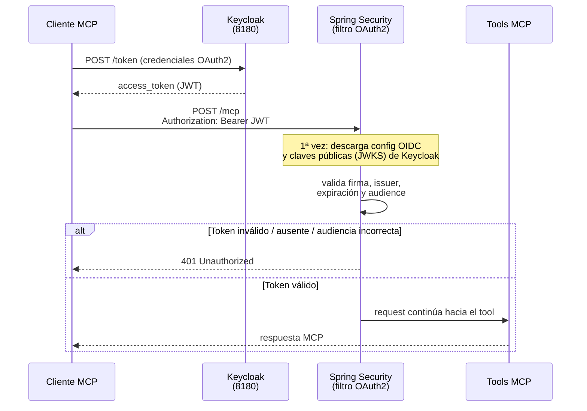

# Autenticación — paso a paso

Este documento explica cómo funciona la autenticación del JDE MCP Server después de la migración a Keycloak. Está pensado para leerse de arriba hacia abajo: primero la idea general, después cada capa en detalle.

---

## La idea general: dos capas independientes

El servidor maneja **dos autenticaciones distintas que no se mezclan**. Entender esta separación es la clave de todo el documento:

| | Capa 1 — Keycloak (OAuth2) | Capa 2 — Sesión JDE (Mulesoft) |
|---|---|---|
| **Pregunta que responde** | ¿Quién sos y podés hablar con este MCP Server? | ¿Qué usuario JDE sos y qué podés hacer en JDE? |
| **Token** | JWT de Keycloak | JWT de Mulesoft/JDE |
| **Viaja en el header** | `Authorization: Bearer <jwt>` | `X-Approver-Token: <jwt>` |
| **Quién lo valida** | Spring Security (este servidor) | Mulesoft / JDE |
| **Cómo se obtiene** | Flujo OAuth2 contra Keycloak | Tool `jde_login` (usuario y contraseña JDE) |
| **Dónde se guarda** | No se guarda (viene en cada request) | `JdeTokenStore` (en memoria, por sesión MCP) |

> ⚠️ **Importante**: el header `Authorization` ya **no** se usa como token JDE. Antes de la migración, el servidor tomaba el Bearer del header y lo reenviaba a Mulesoft como `X-Approver-Token`. Eso ya no existe: el Bearer de Keycloak solo sirve para entrar al endpoint `/mcp`; el token JDE se obtiene únicamente con `jde_login`.

### Vista completa

```
                  ┌──────────────────┐
                  │     Keycloak      │  realm: jde-integration
                  │   (puerto 8180)   │  client: claude-desktop-mcp
                  └────────┬─────────┘
        (1) obtiene JWT    │
            de Keycloak    │
┌──────────────────┐       │
│  Cliente MCP      │◄─────┘
│  (Claude.ai /     │
│  Claude Desktop / │
│  MCP Inspector)   │
└────────┬─────────┘
         │ (2) POST /mcp
         │     Authorization: Bearer <jwt-keycloak>
         ▼
┌──────────────────────────────────────────┐
│  JDE MCP Server (puerto 8080)             │
│                                           │
│  (3) Spring Security valida el JWT:       │
│      firma + issuer + expiración +        │
│      audience == claude-desktop-mcp       │
│      → si falla: HTTP 401, no entra nadie │
│                                           │
│  (4) El tool busca el token JDE en el     │
│      JdeTokenStore (por Mcp-Session-Id)   │
│      → si no hay: pide usar jde_login     │
└────────┬─────────────────────────────────┘
         │ (5) REST con X-Approver-Token: <jwt-jde>
         ▼
┌──────────────────┐        ┌──────────────────┐
│  Mulesoft API     │───────►│  JD Edwards       │
│  (puerto 8083)    │        │  EnterpriseOne    │
└──────────────────┘        └──────────────────┘
```

---

## Capa 1 — Keycloak: la puerta de entrada al servidor

### Qué protege

Todo el endpoint MCP (`/mcp`). Ningún request llega a los tools sin un JWT de Keycloak válido. El resto de los paths quedan abiertos (no hay otros endpoints hoy).

### Paso a paso

1. **El cliente obtiene un token de Keycloak.** El cliente MCP (Claude Desktop, Claude.ai, o vos con `curl` para probar) se autentica contra el realm `jde-integration` y recibe un `access_token` (JWT) emitido para el client `claude-desktop-mcp`.

2. **El cliente llama al MCP Server con ese token.** Cada request a `/mcp` lleva el header `Authorization: Bearer <access_token>`.

3. **Spring Security intercepta el request antes que cualquier código de la aplicación.** El filtro de OAuth2 Resource Server (configurado en `SecurityConfig`) decodifica y valida el JWT:

   | Validación | Qué chequea | Si falla |
   |---|---|---|
   | **Firma** | Que el token esté firmado por Keycloak (claves públicas obtenidas del JWKS del realm) | 401 |
   | **Issuer** | Que el claim `iss` sea exactamente `http://localhost:8180/realms/jde-integration` | 401 |
   | **Expiración** | Que el claim `exp` no haya pasado | 401 |
   | **Audiencia** | Que el claim `aud` contenga `claude-desktop-mcp` | 401 |

   > La validación de **audiencia** es la que evita que cualquier token válido de Keycloak (emitido para otra aplicación del mismo realm) sirva para entrar a este servidor. Sin ella, un token de cualquier otro client sería aceptado.

4. **Si todo pasa, el request sigue su curso normal** hacia el protocolo MCP y los tools. La identidad Keycloak queda disponible en el contexto de seguridad (ver [`AuthenticatedJdeIdentity`](#pieza-pendiente-el-identity-bridge)).

### Diagrama de secuencia



### Detalle de implementación: el discovery es "perezoso"

`SecurityConfig` envuelve el decoder en un `SupplierJwtDecoder`: la llamada a Keycloak para descargar la configuración OIDC y las claves públicas **no ocurre al arrancar el servidor**, sino recién cuando llega el primer token a validar. Por eso el servidor (y los tests) arrancan aunque Keycloak esté apagado — pero el primer request a `/mcp` fallará si Keycloak no está disponible en ese momento.

### Obtener un token a mano (para probar)

```bash
curl -s -X POST \
  http://localhost:8180/realms/jde-integration/protocol/openid-connect/token \
  -H "Content-Type: application/x-www-form-urlencoded" \
  -d "grant_type=password" \
  -d "client_id=claude-desktop-mcp" \
  -d "username=<usuario-keycloak>" \
  -d "password=<password-keycloak>" | jq -r .access_token
```

> El grant exacto depende de cómo esté configurado el client en Keycloak (`password`, `client_credentials`, o el flujo con navegador `authorization_code`). Los tokens de Keycloak suelen durar pocos minutos: para pruebas manuales hay que renovarlos seguido.

---

## Capa 2 — Sesión JDE: quién sos dentro de JD Edwards

Pasar la puerta de Keycloak **no te loguea en JDE**. Para operar (listar órdenes, aprobar, etc.) hace falta una sesión JDE, que se crea con el tool `jde_login`.

### Paso a paso del login

1. **Claude llama al tool `jde_login`** con el usuario y contraseña JDE que le pidió al usuario.

2. **El servidor llama a Mulesoft** (`POST {jde.api.base-url}/v1/login`) con esas credenciales más dos valores fijos: environment `JDV920` y role `*ALL` (hardcodeados en `JdeAuthClient`).

3. **Mulesoft devuelve el token JDE** en el header de respuesta `X-Approver-Token` (un JWT propio de Mulesoft/JDE, distinto al de Keycloak). El body incluye `expiresAt`.

4. **El servidor guarda el token en memoria** (`JdeTokenStore`, un `ConcurrentHashMap`), asociado a la **sesión MCP actual**:
   - La clave es el header `Mcp-Session-Id` que envía el cliente MCP en cada request.
   - Si el cliente no envía ese header (caso del MCP Inspector), se usa la **IP remota** como clave — todos los llamados desde esa IP comparten sesión.
   - La expiración se parsea del claim `exp` del propio JWT, y se considera vencido **5 minutos antes** de la expiración real (margen de seguridad).

### Paso a paso de un tool cualquiera (ya logueado)

1. Claude llama a un tool, por ejemplo `jde_list_pending_purchase_orders`.
2. El tool le pide el token a `JdeAuthService.getOrCreateToken()`, que resuelve la sesión (`Mcp-Session-Id` o IP) y busca en el `JdeTokenStore`.
3. **Si hay token vigente** → se llama a Mulesoft con el header `X-Approver-Token: <jwt-jde>`.
4. **Si Mulesoft devuelve un token renovado** en el header `X-Approver-Token` de la respuesta, el servidor lo guarda reemplazando al anterior (renovación transparente: la sesión se va extendiendo mientras se use).
5. **Si no hay token o está vencido** → se lanza `JdeSessionNotFoundException` con un mensaje que le indica a Claude que debe llamar a `jde_login`. Claude pide las credenciales al usuario, se loguea y reintenta la operación original.

### Diagrama de secuencia completo


### Ciclo de vida del token JDE

```
jde_login ──► token guardado ──► se usa en cada tool ──► Mulesoft lo renueva ──► reemplaza al anterior
                    │                                          (header de respuesta)
                    │
                    ▼  pasa el tiempo sin uso / expira (exp − 5 min)
             token eliminado del store
                    │
                    ▼
      próximo tool ──► JdeSessionNotFoundException ──► Claude vuelve a pedir jde_login
```

---

## Errores frecuentes y cómo leerlos

| Síntoma | Capa | Causa | Solución |
|---|---|---|---|
| `401 Unauthorized` en `/mcp` (el cliente ni conecta) | 1 | Falta el Bearer, está vencido, o la audiencia no es `claude-desktop-mcp` | Obtener un token nuevo de Keycloak / revisar el mapper de audiencia en el client |
| `401` solo en el primer request tras arrancar | 1 | Keycloak apagado: el discovery perezoso falla al validar el primer token | Levantar Keycloak y reintentar |
| El tool responde "Sesión JDE no encontrada… usá `jde_login`" | 2 | No hay token JDE para esta sesión MCP (nunca se logueó, o venció) | Llamar a `jde_login` |
| Login falla con "Authentication failed" | 2 | Credenciales JDE inválidas, o Mulesoft no devolvió `X-Approver-Token` | Verificar credenciales / revisar Mulesoft |
| El Inspector "comparte" la sesión entre pestañas | 2 | El Inspector no envía `Mcp-Session-Id`; la clave de sesión es la IP | Comportamiento esperado en desarrollo |

---

## Pieza pendiente: el identity bridge

Hoy las dos capas están **desconectadas**: Keycloak dice quién sos, pero igual tenés que tipear usuario y contraseña JDE en `jde_login`.

El plan a futuro es un **identity bridge** que mapee el `sub` (subject) del token de Keycloak directamente a una credencial JDE (usuario/environment/role), eliminando el `jde_login` manual. La clase `AuthenticatedJdeIdentity` (en `security/`) ya expone lo necesario para construirlo:

- `currentSubject()` — el `sub` de Keycloak del request actual.
- `currentJdeTechnicalAccountClaim()` — el claim custom `jde_technical_account`, para el caso de vendedores externos que se mapean a una cuenta técnica JDE por grupo, no por usuario individual.

El componente que resuelve `sub → credencial JDE` todavía no está construido.

---

## Configuración relevante

En `src/main/resources/application.properties`:

| Propiedad | Valor por defecto | Qué controla |
|---|---|---|
| `spring.security.oauth2.resourceserver.jwt.issuer-uri` | `http://localhost:8180/realms/jde-integration` | Contra qué Keycloak/realm se validan los tokens (Capa 1) |
| `jde.mcp.security.expected-audience` | `claude-desktop-mcp` | Audiencia (`aud`) exigida en los tokens (Capa 1) |
| `jde.api.base-url` | `http://localhost:8083/api` | Mulesoft para login y compras (Capa 2) |
| `jde.so.api.base-url` | `http://localhost:8083/api` | Mulesoft para sales orders (Capa 2) |
| `jde.api.login-timeout-minutes` | `5` | Timeout del request de login (Capa 2) |

Código involucrado:

- **Capa 1**: `security/SecurityConfig.java` (filtro + validadores), `security/AuthenticatedJdeIdentity.java` (identidad del request).
- **Capa 2**: `auth/JdeAuthClient.java` (login contra Mulesoft), `auth/JdeAuthService.java` (resolución de sesión), `auth/JdeTokenStore.java` (almacenamiento y expiración), `purchase/tools/JdeLoginTool.java` (el tool `jde_login`).
